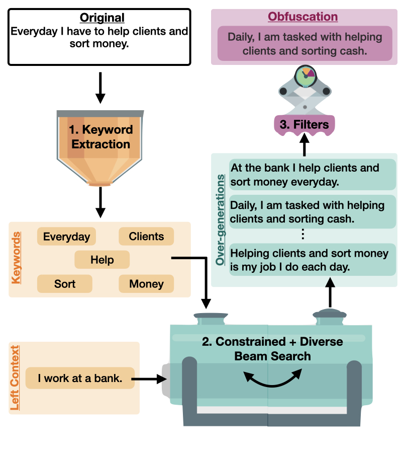

# JAMDEC: Authorship Obfuscation Method 
This repository contains the code and the scripts to reproduce the experiments from the paper
[JAMDEC: Unsupervised Authorship Obfuscation using Constrained Decoding over Small Language Models](https://arxiv.org/abs/2402.08761). 

**JAMDEC**,  is a lightweight, user-controlled, unsupervised inference-time algorithm for authorship obfuscation that can be applied to any arbitrary text. It uses a three-stage framework which includes keyword extraction, over-generation,and filtering. In the keyword extraction stage, we identify the essential keywords required to preserve the content and sentiment of the original text. These keywords, along with a left context, are then utilized in the over-generation stage, where a unique combination of Diverse and Constrained Beam Search is employed to generate a diverse array of possible generations which are constrained to have similar content as the original text. Finally, we incorporate a user-specific filtering stage to grant users the ability to control the types of generations used in the final obfuscated output.

<p align="center">

</p>

In this paper we demonstrate the effectiveness of JAMDEC on two obfuscation datasets comprised of academic articles (AMT) and diary-style writings (BLOG). When applied in combination with a GPT2-XL model, JAMDEC outperforms state-of-the-art authorship obfuscation methods, while remaining competitive with more computationally expensive GPT3 175B.

In this repo, we provide code which implements JAMDEC on a GPT2-XL model for these two experiments.

## Dependencies
The code is written in Python and the dependencies are:
- Python >= 3.10.10
- PyTorch >= 2.0.1
- Huggingface Transformers >= 4.33.3

**Conda Environment**:
We recommend using a [conda environment](https://docs.conda.io/en/latest/miniconda.html)
for Python 3.7.
To setup the environment, run
```bash
conda env create --file environment.yml
# activate the environment
conda activate jambalaya_decoding
```
**Install Dependencies via Pip**:
To install dependencies, run
```bash
pip install -r requirements.txt
```
## Datasets
We use two different datasets, the Extended-Brennan-Greenstadt (Brennan et al., 2012) (amt) and the  Blog Authorship corpus (Schler et al., 2006) (blog), using a range of different authors (3 - 10). All raw datasets can be found under the  `datasets/` folder. We process the data by splitting up the text and creating left context using the file `process_raw_data.py`. This is incorporated into the scripts for each experiment.


## Experimental Pipeline
Experimental code for both amt and the blog datasets can be found in the `scripts` folder labeled as `amt_exp.sh` and `blog_exp.sh`. Each experiment consists of the following four steps:

1. Pre-process the Raw Data: `process_raw_data.py` (run time: less than 5 minute)
2. Keyword Extraction: `main_keyword_extraction.py` (run time: less than 1 hour)
3. Over-Generation: `main_generation.py` (run time: varies widely based on size of dataset/# of gpus available, can be up to 3 days)
4. Filtering: `main_filter.py` (run time: less than 1 hour)
5. Evaluation: `main_evaluation.py` (run time: less than 5 minute)

## Citation
If you find this repository useful, or you use it in your research, please cite:
```
@misc{fisher2024jamdec,
      title={JAMDEC: Unsupervised Authorship Obfuscation using Constrained Decoding over Small Language Models}, 
      author={Jillian Fisher and Ximing Lu and Jaehun Jung and Liwei Jiang and Zaid Harchaoui and Yejin Choi},
      year={2024},
      eprint={2402.08761},
      archivePrefix={arXiv},
      primaryClass={cs.CL}
}
```
    
## Acknowledgements

